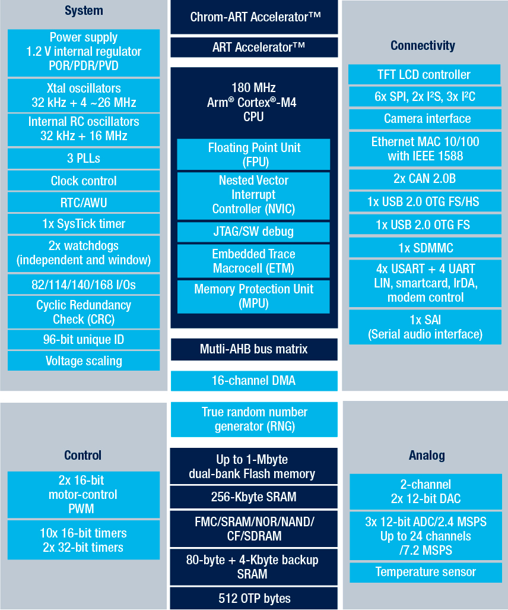
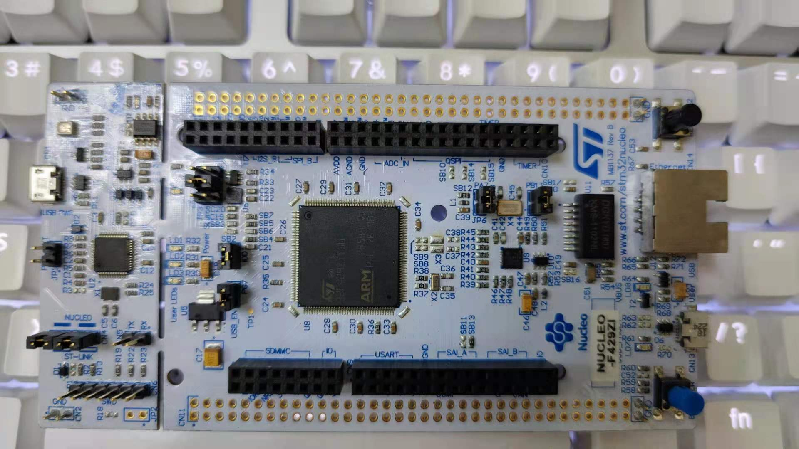

# [STM32F429](https://github.com/SoCXin/STM32F429)

* [ST](https://www.st.com/zh/): [Cortex-M4](https://github.com/SoCXin/Cortex)
* [L5R5](https://github.com/SoCXin/Level): 180 MHz (225DMIPS/608CoreMark)

## [简介](https://github.com/SoCXin/STM32F429/wiki)

### 关键特性

* 20个通信接口（包括4个USART、4个速度达11.25 Mbit/s的UART、6个速度达45 Mbit/s的SPI、3个具有新型可选数字滤波器功能的I²C、2个CAN、SDIO）
* 2xDAC 12bit,  3 x ADC / 24ch x 12bit 2.4MSPS(交错模式7.2MSPS)
* 17个定时器：16位和32位，工作频率可达180 MHz

### [资源收录](https://github.com/SoCXin)

* [参考资源](src/)
* [参考文档](docs/)
* [参考工程](project/)

### [选型建议](https://github.com/SoCXin)

与[STM32F429](https://github.com/SoCXin/STM32F429)拥有相似配置的STM32F427在参数规格上有下降，资源丰富度也不及前者，就性价比而言需要综合市场因素进行评估。

#### 封装规格

* LQFP100 (14×14mm)
* LQFP144 (20×20mm)
* LQFP176 (10×10mm)

[STM32F4系列](https://www.st.com/zh/microcontrollers-microprocessors/stm32f4-series.html)与[STM32F1系列](https://www.st.com/zh/microcontrollers-microprocessors/stm32f1-series.html)外设兼容性：

### 相关开发板

#### 高完成度开源项目

* [Arduino_Core_STM32](https://github.com/stm32duino/Arduino_Core_STM32)
* [STM32CubeF4](https://github.com/STMicroelectronics/STM32CubeF4)

### [探索芯世界 www.SoC.xin](http://www.SoC.Xin)
